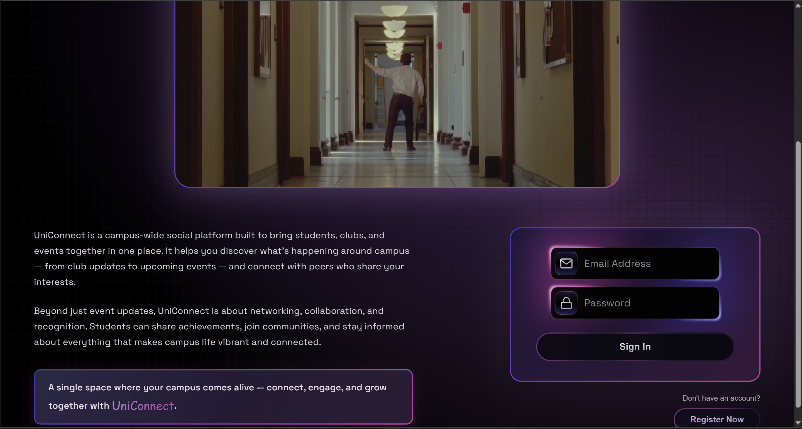
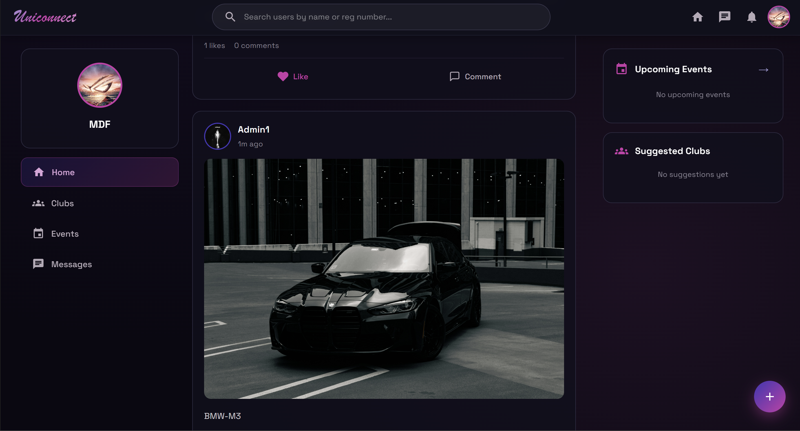
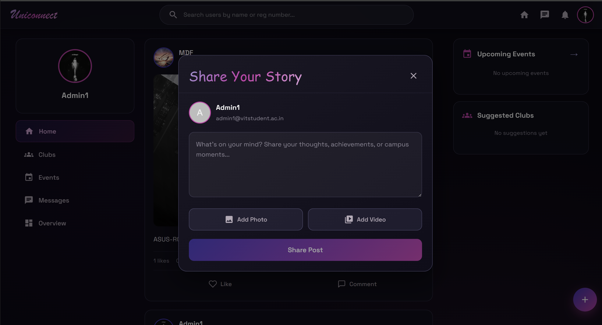
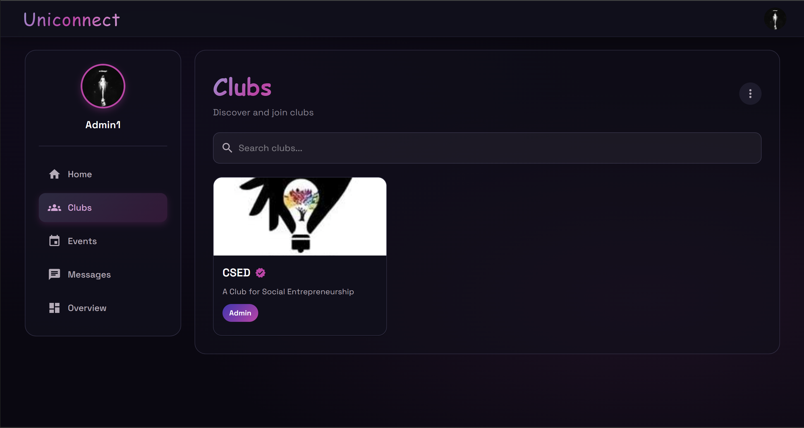
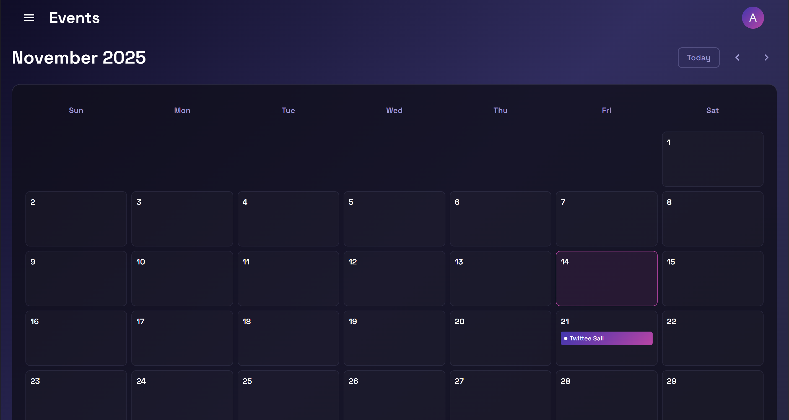
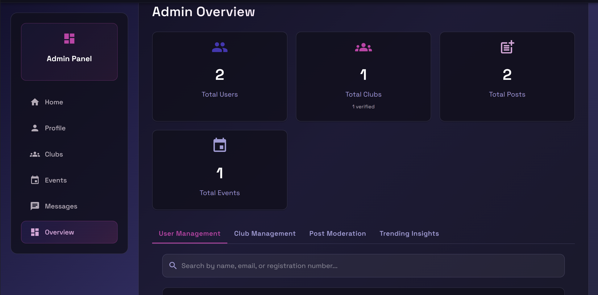
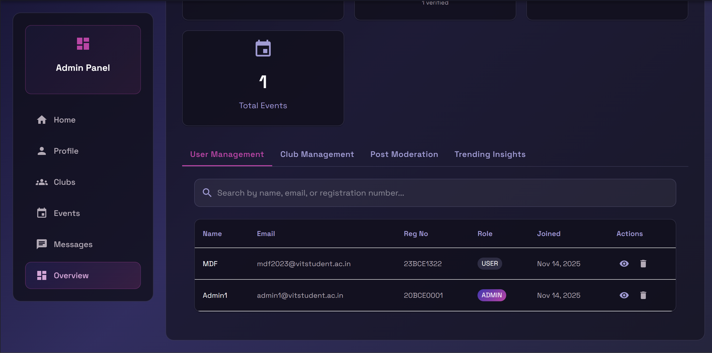

<<<<<<< HEAD
# UniConnect

A full‑stack university social platform for VIT students with posts, clubs, events, chat, and an admin dashboard.

- React + TypeScript (MUI, React Router)
- Spring Boot 3 + Java 21 (JWT, Spring Security, JPA)
- MySQL 8
- Deployed on AWS (EC2 + RDS + S3 + Amplify)

---

## Table of Contents

1. Project Overview
2. Features
3. Tech Stack
4. Repository Structure
5. Prerequisites
6. Local Setup and Run
7. Environment Configuration
8. Build and Test
9. AWS Deployment Presentation Guide
10. Security
11. Cost and Optimization
12. Challenges & Solutions
13. Demo Flow
14. Q&A Prep
15. .gitignore Recommendations

---

## 1) Project Overview

UniConnect is a university social platform for VIT students enabling social networking, club and event management, real‑time chat, and an admin dashboard.

---

## 2) Features

- Authentication with VIT email + JWT
- User profiles (bio, avatar), feed with posts, likes, comments
- Clubs (create/join/manage with roles)
- Events (OD tracking)
- Real‑time chat
- Admin dashboard (moderation, analytics)

---

## 3) Tech Stack

- Backend: Spring Boot 3.3.3, Java 21, Spring Security (JWT), Spring Data JPA, Maven, MySQL 8
- Frontend: React 19, TypeScript, CRA, React Router v7, Material UI, Axios
- Storage: Local filesystem (dev) or AWS S3 (prod)
- Deployment: AWS EC2 (backend), RDS (MySQL), S3 (media), Amplify (frontend)

---

## 4) Repository Structure

```
UniConnect/
├─ unisocial-frontend/         # React app
│  ├─ src/
│  ├─ package.json
│  ├─ env.example              # sample frontend env
│  └─ (build/, node_modules/ not committed)
├─ unisocial-backend/          # Spring Boot app
│  ├─ src/main/java/
│  ├─ src/main/resources/application.properties
│  ├─ pom.xml
│  └─ (target/ not committed)
├─ uploads/                    # local uploads (dev only, not committed)
└─ README.md
```

---

## 5) Prerequisites

- Node.js (LTS) and npm
- Java 21
- Maven 3.9+
- MySQL 8

---

## 6) Local Setup and Run

### Database

- Create DB:
  ```sql
  CREATE DATABASE IF NOT EXISTS unisocial;
  ```
- Configure credentials in `unisocial-backend/src/main/resources/application.properties`:
  ```properties
  spring.datasource.url=jdbc:mysql://localhost:3306/unisocial?useSSL=false&allowPublicKeyRetrieval=true&serverTimezone=UTC
  spring.datasource.username=<your_mysql_user>
  spring.datasource.password=<your_mysql_password>
  spring.jpa.hibernate.ddl-auto=update
  ```
- Ensure `file.upload-dir` points to a valid local folder.

### Backend (Spring Boot)

```bash
# from unisocial-backend
mvn spring-boot:run
# runs at http://localhost:8080
```

### Frontend (React)

```bash
# from unisocial-frontend
cp env.example .env          # or create .env
# Ensure
# REACT_APP_API_URL=http://localhost:8080
npm install
npm start                    # http://localhost:3000
```

---

## 7) Environment Configuration

- Frontend: `unisocial-frontend/.env`
  ```env
  REACT_APP_API_URL=http://localhost:8080
  ```
- Backend: `application.properties` (avoid committing secrets). Prefer:
  - Environment variables: `${DB_USER}`, `${DB_PASS}`
  - Or `application-local.properties` (gitignored) with `--spring.profiles.active=local`

---

## 8) Build and Test

### Frontend
```bash
npm run build
npm test
```

### Backend
```bash
mvn clean package
java -jar target/unisocial-backend-0.0.1-SNAPSHOT.jar
mvn test
```

---

## 9) AWS Deployment (Summary)

- **Services Used**
  - **EC2**: Hosts Spring Boot backend (HTTPS: 8443)
  - **RDS MySQL**: Managed database
  - **S3**: Media storage (images/videos/profile pictures)
  - **Amplify + CloudFront**: Hosts the React frontend with HTTPS and CDN
  - **IAM**: EC2 instance role for secure S3 access (no hardcoded keys)

- **Backend Deployment (EC2)**
  - Build jar: `mvn clean package -DskipTests`
  - Copy jar to EC2 and run with AWS profile: `java -jar -Dspring.profiles.active=aws app.jar`
  - Expose port 8443 in EC2 Security Group; allow EC2 SG to access RDS (3306)
  - Use self‑signed SSL for demo or ACM + ALB for production

- **Frontend Deployment (Amplify)**
  - Set `REACT_APP_API_URL=https://<backend-domain-or-ip>:8443`
  - `npm run build` and upload the `build/` folder to Amplify (manual deploy)

- **Notes**
  - Configure CORS on backend to allow the Amplify domain
  - Store secrets in environment or AWS Parameter Store/Secrets Manager
  - Prefer S3 for media in production; avoid storing uploads on EC2 disk

## 9.1) Screenshots

Screenshots are stored under `docs/screenshots/`:

- Login


- Dashboard feed


- Create Post


- Clubs page


- Events page


- Admin overview


- Admin overview (analytics)


---

## 10) Security

- Do not commit secrets. Use env vars or local profiles.
- Frontend: commit `env.example`, never commit `.env` with secrets.
- Backend: move real credentials to `application-local.properties` (gitignored) or environment.

---

## 11) Cost and Optimization

- Free tier friendly; ~ $26/month post‑free tier baseline.
- Use reserved instances, scale EC2/RDS as needed, S3 lifecycle policies.

---

## 12) Challenges & Solutions (Quick)

- HTTPS mismatch → enable SSL on backend or put ALB/ACM
- S3 public access → use bucket policy, no ACLs
- DB connectivity → SG rules to allow EC2 → RDS

---


## 13) .gitignore Recommendations

```
# Node/React
unisocial-frontend/node_modules/
unisocial-frontend/build/
unisocial-frontend/.env

# Java/Spring
unisocial-backend/target/
unisocial-backend/*.iml
unisocial-backend/.classpath
unisocial-backend/.project
unisocial-backend/.settings/
unisocial-backend/src/main/resources/application-local.properties

# Local uploads
uploads/

# IDE
.vscode/
.idea/
.metadata/

# OS junk
.DS_Store
Thumbs.db
```
=======
# UniConnect-aka-CampusChain
>>>>>>> 7799bbc77879e347bd6c312689c147582534ca03
